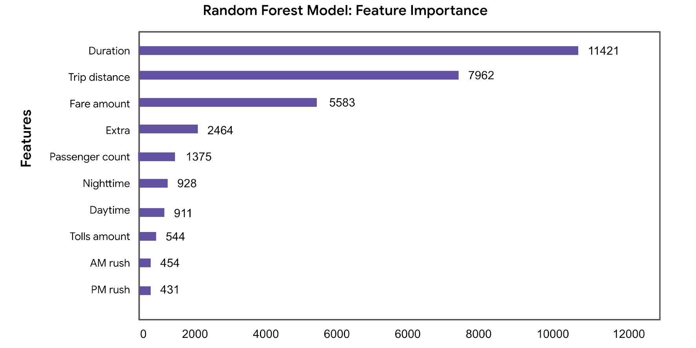

# Predicting Taxi Gratuities in NYC
<section> <h2>Overview</h2>
The goal of this project was to create multiple linear gegression and random forest model to predict high rider gratuity or not. This project utilized yellow taxi trips taken in New York City during 2017. The final random forest model performed with 86% accuracy and 72% precision determining what features were important in separating low tippers from high tippers. Based on the model, the duration, distance, and cost of the trip were most influential in determining a generous tipper (>20%) vs a non_generous one (<20%).
</section>
  
<section>
  <h2>Business Understanding</h2>
  According to salary.com the average salary for a New York Taxi Driver is around $45,000. This salary is significantly low compared to a medium rent value of $6,500 per month. It is important to understand what factors encouage riders to leave tips in order to help drivers obtain a livable wage.
</section>

<section>
  <h2> Data Understanding</h2>
  The NYC Taxi and Limousine Commision data came from <a href="https://www.nyc.gov/site/tlc/about/tlc-trip-record-data.page">NYC.gov</a>. The data consisted of appromimately 408K unique trips and 18 features. The features included information on trip duration and destination, vendor used, toll information and payment type. The bar chart below shows the breakdown of how many generous tippers (>20%) versus non_generous tippers that exist in the data set. 
  
In connection to this, a feature was engineered to represent if a ride was taken during rush hour or not. Multiple redundant columns were dropped and reformatted into the proper date type.
</section>

<section>
  <h2>Modeling and Evaluation</h2>
A random forest model comprising 100 decision trees was used to determine feature importance in who would tip generously or not. The below plot shows that trip duration, distance and the cost of a fare were the Top 3 most important factors in performed with 86% accuracy and 72% precision.

</section>
